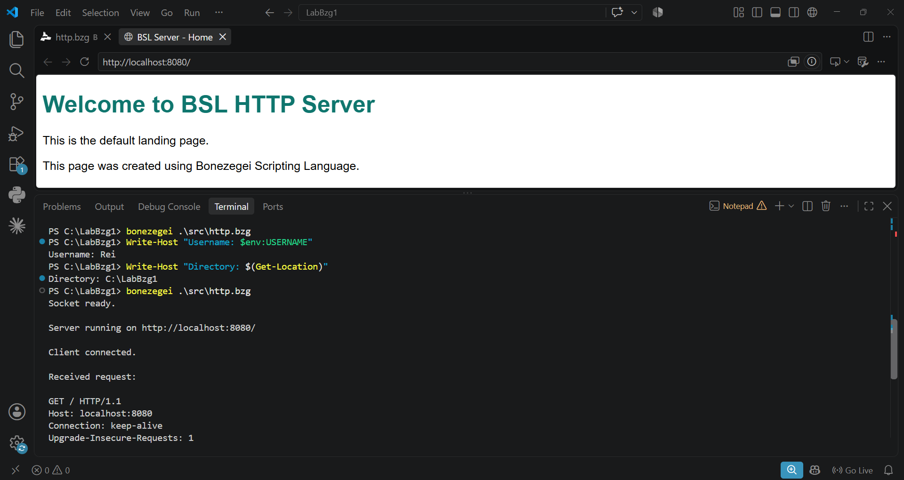
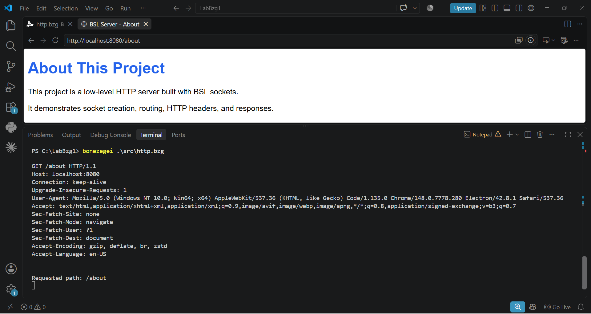
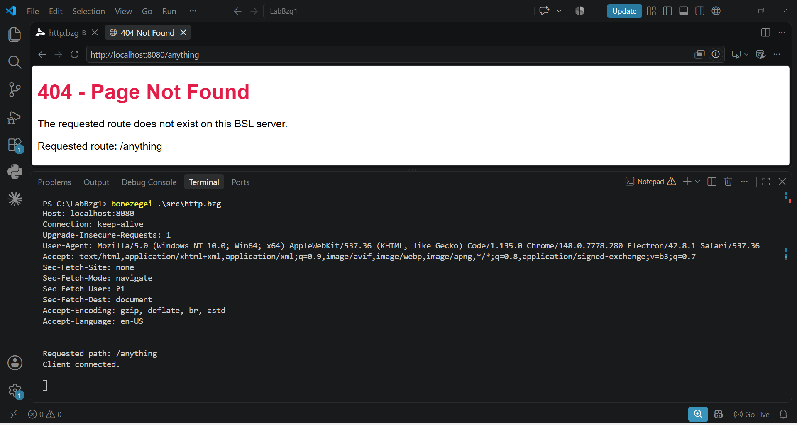
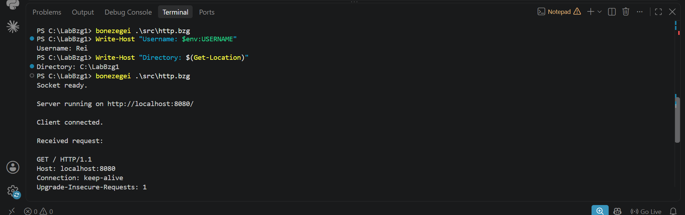

# my-bsl-http-server

A low-level HTTP web server built from scratch using the Bonezegei Scripting Language and the BSL socket library.

## Project Description

This project implements a basic HTTP server using low-level socket programming in Bonezegei Scripting Language.

The server listens on port `8080`, accepts incoming browser connections, reads HTTP requests, identifies the requested path, and returns an HTML response.

The project demonstrates:

- Socket initialization.
- Server socket creation.
- Binding to port `8080`.
- Listening for client connections.
- Accepting browser requests.
- Reading HTTP request data.
- Custom route handling.
- HTTP status responses.
- Sending HTML content over a socket.

## Routes

| Route | Description | HTTP response |
|---|---|---|
| `/` | Default landing page | `200 OK` |
| `/about` | About page | `200 OK` |
| Any other route | Custom error page | `404 Not Found` |

## Requirements

- Windows, Linux, or a supported BSL environment.
- Bonezegei Scripting Language interpreter.
- Visual Studio Code.
- Bonezegei Scripting Language Formatter extension.
- BSL socket library.
- A web browser.

## Installation

Verify that Bonezegei is installed:

```powershell
bonezegei --version
```

Install the socket library:

```powershell
bzg install socket
```

## Running the Server

From the project directory, run:

```powershell
bonezegei .\src\http.bzg
```

The server will start on:

```text
http://localhost:8080/
```

Keep the terminal open while using the server.

## Testing the Routes

Open the following addresses in a web browser:

- Home page: [http://localhost:8080/](http://localhost:8080/)
- About page: [http://localhost:8080/about](http://localhost:8080/about)
- 404 page: [http://localhost:8080/anything](http://localhost:8080/anything)

The home and about routes return `HTTP/1.1 200 OK`.

Unknown routes return `HTTP/1.1 404 Not Found`.

## Testing with PowerShell

The server can also be tested using `curl`:

```powershell
curl.exe -i http://localhost:8080/
```

```powershell
curl.exe -i http://localhost:8080/about
```

```powershell
curl.exe -i http://localhost:8080/anything
```

## Screenshots

### Home route



### About route



### 404 route



### Terminal running the server



## Project Structure

```text
my-bsl-http-server/
├── .gitattributes
├── LICENSE
├── README.md
├── src/
│   └── http.bzg
└── documentation/
    ├── home.png
    ├── about.png
    ├── 404.png
    └── terminal.png
```

## License

This project is licensed under the MIT License.
